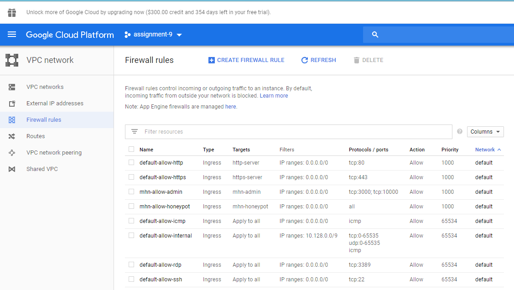
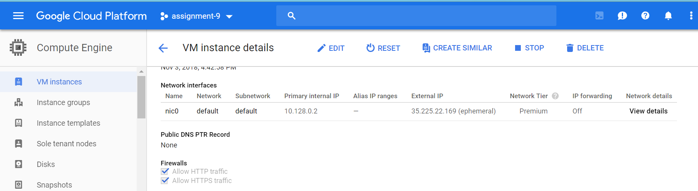
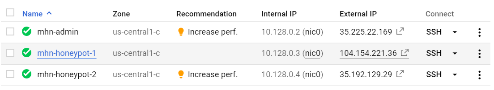
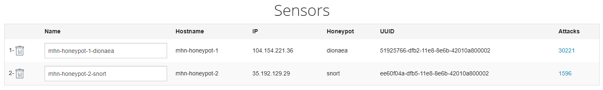
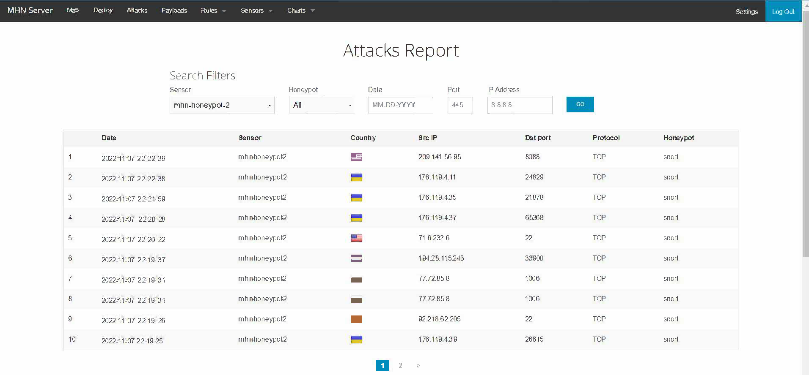

# Week 9 Project: Honeypot

Time spent: 15 hours spent in total

### Project summery 

In this project we stand up a basic honeypot and demonstarte its effectiveans at detecting and collecting data about an attack. The project requires to use a well-supported open source honeypot, which is Modern Honey Network(MHN). MHN is a centralized server for management and data collection of honeypots.

### Milestone 0 : Google Cloude Set Up

To accomplish this project we required to set up Google Cloud Platforms(GCP) Free Tier or alternative one Cloud Platforms. After setting up the platform we initialized the zone and region.

### Milestone 1 : Create MHN Admin VM 

Since GCP require to create the firewall rules seperatley and then apply them to the VM we require to use the following attrubutes.

- Ubuntu 14.04(trusty)
- HTTP traffic allowed(port 80)
- TCP ports 3000 and 100000

Command used 
gcloud beta compute firewall-rules create mhn-allow-admin --direction=INGRESS --priority=1000 --network=default --action=ALLOW --rules=tcp:3000,tcp:10000 --source-ranges=0.0.0.0/0 --target-tags=mhn-admin

Result 



### Milestone 2 : Install the MHN Admin Application 

In this step we install the server and login to server using our"superuser"


### Milestone 3 : Create a MHN Honeypot VM 

In this step we deploy Dionaea over HTTP

Dionaea is "meant to be a nepenthes successor , embedding python as scripting language, using libemu to detect shellcodes, supporting ipv6 and tls"



### Milestone 4 : Install the Honeypot Application

In this step we install honeypot application into the VM and wire it to connect back to the admin server.

The wget command executed inside the honeypot VM to install the Dionae sorftware .

wget "http://35.184.8.8/api/script/?text=true&script_id=4" -O deploy.sh && sudo bash deploy.sh http://35.184.8.8 yYw8AEVE



### Milestone 5 : Attack!

In this step we can make sure everything is set up correctly and working by using nmap command.
1) Dionea
```sigintz@mhn-honeypot-1:~$ nmap 35.185.194.21

Starting Nmap 6.40 ( http://nmap.org ) at 2022-11-07 20:15 UTC
Nmap scan report for 21.194.185.35.bc.googleusercontent.com (35.185.194.21)
Host is up (0.0022s latency).
Not shown: 988 closed ports
PORT     STATE    SERVICE
21/tcp   open     ftp
22/tcp   open     ssh
25/tcp   filtered smtp
42/tcp   open     nameserver
135/tcp  open     msrpc
445/tcp  open     microsoft-ds
465/tcp  filtered smtps
587/tcp  filtered submission
1433/tcp open     ms-sql-s
3306/tcp open     mysql
5060/tcp open     sip
5061/tcp open     sip-tls

Nmap done: 1 IP address (1 host up) scanned in 1.24 seconds
```

2) Dionea with HTTP:
```sigintz@mhn-honeypot-2:~$ nmap 35.197.36.229

Starting Nmap 6.40 ( http://nmap.org ) at 2022-11-07 20:29 UTC
Nmap scan report for 229.36.197.35.bc.googleusercontent.com (35.197.36.229)
Host is up (0.0028s latency).
Not shown: 986 closed ports
PORT     STATE    SERVICE
21/tcp   open     ftp
22/tcp   open     ssh
25/tcp   filtered smtp
42/tcp   open     nameserver
80/tcp   open     http
135/tcp  open     msrpc
443/tcp  open     https
445/tcp  open     microsoft-ds
465/tcp  filtered smtps
587/tcp  filtered submission
1433/tcp open     ms-sql-s
3306/tcp open     mysql
5060/tcp open     sip
5061/tcp open     sip-tls

Nmap done: 1 IP address (1 host up) scanned in 1.25 seconds
```



